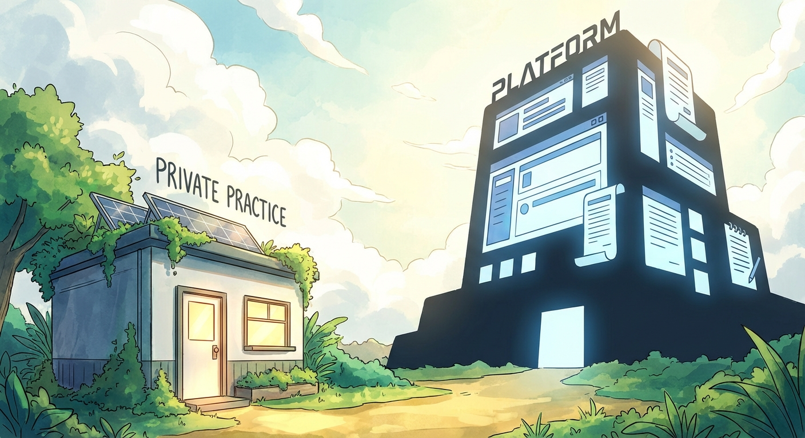
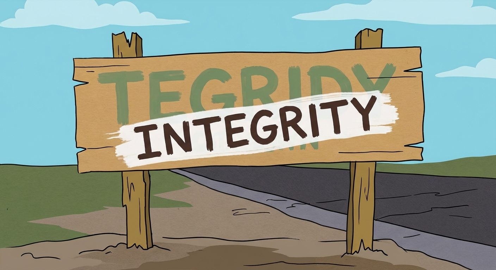

I may be as naive as Randy from *South Park*, who finally fulfills his dream of living in the countryside—by naming his weed farm **Tegridy Farms**. It’s a pun, obviously, and the whole arc is basically a lecture on “integrity” delivered by a man selling weed merch. ([en.wikipedia.org](https://en.wikipedia.org/wiki/Tegridy_Farms?utm_source=openai))

As Randy would say: people just ain’t got no tegridy anymore.

This morning (well—*today*, as I’m writing this), a therapist contacted me with a question that made my stomach drop a little:

He’s being sued by a therapist platform over an alleged breach of contract—because he kept building his practice through other channels. He didn’t think he signed anything exclusive. But apparently he did.

And that… is the part that gets me. Not “competition”. Not “hustle”. Not “sales”. The *accidental exclusivity*.

The platform in question is incorporated in Delaware—still the default jurisdiction for a lot of venture-backed companies because of predictable corporate law and its Court of Chancery. ([corplaw.delaware.gov](https://corplaw.delaware.gov/why-businesses-choose-delaware/?utm_source=openai)) The brand is sleek. The logo is slick. The legal teeth are real.

We’ve seen versions of this story before: platforms that begin as “empowerment” and, once they scale, quietly become **gatekeepers**. In mental health specifically, BetterHelp has drawn major scrutiny—for example from the FTC over the sharing of sensitive consumer data for advertising (settled with a $7.8M order/refunds). ([ftc.gov](https://www.ftc.gov/news-events/news/press-releases/2023/07/ftc-gives-final-approval-order-banning-betterhelp-sharing-sensitive-health-data-advertising?trk=public_post_comment-text&utm_source=openai))

Different issue than therapist exclusivity, yes—but similar pattern: *platform incentives drifting away from human dignity*.

It sickens me and makes me deeply sad that technology can be used to create market power that destroys individuals and small practices in the process. Platforms are supposed to empower people. Yet very few manage to maintain that integrity after their initial success.

## This is the way (…or not)

I don’t claim to have the panacea for companies growing so large they stifle competition and innovation.

And I also know my opinion here is unpopular in parts of the entrepreneurial mainstream—especially the branch that celebrates monopoly as destiny. Peter Thiel is famous for arguing that businesses should aim to escape competition rather than fight inside it. ([futurestartup.com](https://futurestartup.com/2015/11/15/how-to-build-a-one-of-a-kind-company-an-interview-with-peter-thiel/?utm_source=openai))

I personally *don’t* think “this is the way”.

My responsibility as an entrepreneur—and as a member of our global society and local communities—is to generate **wealth for me and those around me**. And I don’t mean “wealth” only in financial terms.

There’s a wonderful book on this: ***The 5 Types of Wealth\*** by **Sahil Bloom**. ([penguinrandomhouse.com](https://www.penguinrandomhouse.com/books/731381/the-5-types-of-wealth-by-sahil-bloom/?utm_source=openai))
My former roommate would look at me funny right now and say: “Is this another book you’re recommending that you haven’t read?”

Yes.

I read the quick run-down, and the idea resonated deeply: wealth is multidimensional. I try to revisit that as a small mindfulness exercise—especially at the end of the year when reflection gets unavoidable.

## My name on the door

My company is not called “Soma Therapy” or some other generic, easily sellable name. It’s called **Kaufmann Health**.

My name.

Because when a therapist signs a contract with us, they’re not signing with a faceless platform optimized for “exit value”. They’re signing with *me*. And I have to live with that—with every decision I make that affects real lives, personally.

And, quite frankly, I think that’s part of what it means to be a true entrepreneur.

Having your name on the door is *not* a necessary condition for integrity (there are great counterexamples), and it’s also not sufficient. Plenty of founder-named companies have operated without integrity. Putting your name on something doesn’t magically make you accountable—it just makes your failures more personally embarrassing.

But embarrassment is underrated. It’s a form of friction. And friction is sometimes what keeps you honest.

## The future needs more integrity and connection

I’m an advocate for a Solarpunk future: humans, flora, and fauna in harmony; technology used for common progress; “better” measured in more than GDP.

So when I build a therapist platform, my goal is to nurture a new being—a company—into existence so that it can nurture others: therapy clients and therapists.

A good intermediary can reduce friction on both sides and create a **win-win**: help therapists build sustainable practices, and help clients find real support.

This is one of the amazing things individual businesses—and by extension the economy—*can* do. Adam Smith wrote about competition pushing prices down over time; he also warned about monopoly pricing power: “**The price of monopoly is… the highest which can be got.**” ([davidmhart.com](https://davidmhart.com/liberty/Books/1904-Smith_WealthNations/Smith_WoN1-1904-ebook.html?utm_source=openai))

It’s interesting: as an entrepreneur I fear competition immensely. But not because there might be another Konstantin somewhere building another therapy marketplace.

I fear existing monopolies.

If they want to price me out of the market, they can. If they want to outspend me on acquisition, they can. If they want to turn “relationships” into “clauses”, they can.

And that fear tempts you toward the same medicine: raise capital, chase growth, extract more, lock people in—because you “have to”.

Maybe you don’t.

## What integrity looks like (in practice)

For me, the only way forward is integrity and connection: relationships, not just contracts.

- **No accidental exclusivity.** If something is exclusive, it should *scream* in plain language. Exclusivity should be **a choice**, not a footnote.
- **Clarity over cleverness.** Contracts should be readable by humans, not just defensible by lawyers. If a therapist can’t understand the contract, **that’s not consent**.
- **Alignment over extraction.** We run a **commission-based model**: we benefit when therapists benefit. No monthly fee that quietly drains value, and no “pay to exist” subscription just to stay listed. A monthly fee that doesn’t create value is just **rent**.
- **Connection as a feature.** Platforms shouldn’t replace relationships with clauses. We try to build trust through real human support—because therapy is human work, and so is running a practice.
- **Win-win as the flywheel.** When therapists flourish, clients get better care. When clients find the right fit, therapists flourish. Our job as an intermediary is to reduce friction—without taking ownership of people’s livelihoods.

It’s an idealistic path. It’s also the only one I’m interested in walking.

It’s the path walked by few—but those are the companies (and people) I admire most.