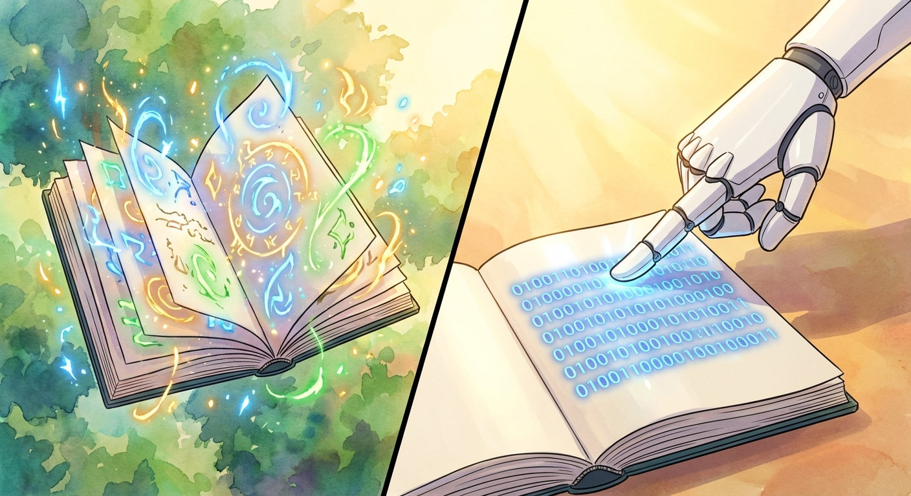

Real talk here: **how much have you been using AI for lately?** 

**My confession:** I use it all the time. Too much? I don't want to get philosophical here about whether we should or should not outsource our thinking to AI. (Spoiler alert: I don't think we should, and likely neither do you)

There's one area where **I have used AI too much**. And that's for writing. Even my last blog posts. That's a big no no. 

No, I don't tell an LLM to "write an insightful blogpost about the launch fo Gemini 3". Though we both know, there are plenty of people who do so.

No, I used Gemini or Claude or whoever is handy - wait, I should say *whatever* is handy - to re-write and *improve* my writing. To *structure* it on behalf of me. To *convey my points more clearly.* Or to *make my article more poignant*. It's not a crime, of course, to do that. 

But it does take away from the character of my writing, does it not? To have the nouances of my personality be "ironed over" in the name of legibilty. Behavior that does not come from stength, but rather the fear that "**my writing is not good enough**". Awful! 

## AI and Imposter Syndrome

**I've had imposter syndrome all my life**, and learned to use it as a superpower. I've learned to love that feeling of discomfort when I face an unknown challenge, when I do something for the first time. In fact, I've recently discovered I likely feel *best* in the face of fear. Unintuitive, I know, that's why it took me 30-odd years to discover. But I've been writing about it in personal journals for years. 

I refer to that feeling as cliff jumping. And I want to do it all my life. Why cliff jumping?

**Picture this:** you're standing atop of a cliff, rocks and some fauna at your feet, looking down at the dark blue sea. And you're about to jump. It's high, very high, you can't really gauge just how high without getting dizzy. But your friend jumps, and you know you can do it too. So you jump! You take the leap. And the thrill drives a bolt of lightning through your heart as you're about to touch the surface. And then it's all over again as the water crashes over your head and cloggs up your ears and nose.

But here's the thing: the next time you stand atopof that cliff, ready to jump. You know the reward. But it's not any easier to overcome that initial inertia. That fear that something might happen. That you hit the surface belly first or something. That you hit a rock you missed before. That you don't come up again.

**That's cliff jumping.** That's doing something rewarding and something new. But it's new every time. It never gets easier. You just get better at managing the fear, and at focusing on the reward over the risks.

So say I've gotten decent at writing. And say I've written enough to focus on the rewards of writing and publishing the writing over the fear of "putting myself out there". Let's say that's true. What has changed for me? 

People are all of a sudden jumping those cliffs with mecha suits or virtually linked to robots! Getting the thrill without the skin in the game. It's a video game all of a sudden and I'm still on *flesh and bones* hardware. So I think "hey, these people are jumping from way higher cliffs" and "they look way better doing this than I do". So I get on my exoskeleton and take the jump. Easy.

But good? Authentic? Real? 

**Might you need the skin in the game after all?!**

## The robots beat the humans a long time ago

Did you watch **The Thinking Game** yet? It's [available for free on YouTube](https://www.youtube.com/watch?v=d95J8yzvjbQ), go watch it this evening if you can. It absolutely moved me. 

> The Thinking Game takes you on a journey into the heart of DeepMind, capturing a team striving to unravel the mysteries of intelligence and life itself.
>
> Filmed over five years by the award winning team behind AlphaGo, the documentary examines how Demis Hassabis’s extraordinary beginnings shaped his lifelong pursuit of artificial general intelligence. It chronicles the rigorous process of scientific discovery, documenting how the team moved from mastering complex strategy games to the ups and downs of solving a 50-year-old "protein folding problem" with AlphaFold.

There was more than one moment at which I was like "damn, computers can totally solve that problem already". 

**The interesting bit?** The problem is still as popular as it ever was. The fact that an AI beat the world champion at chess **did not** result in humans abandoning chess as an interesting challenge. On the contrary. Demis Hassabis, former chess prodigy, **picked up chess again** as a result of his seeing an AI beat a human at chess.

So I'm picking up writing again. As a challenge. Not to beat an AI at it. Do the VR cliff jump all you like. But to have real skin in the game. To experience the real thrill and challenge of putting my thoughts into words.

To **enjoy the game, not the outcome**. !